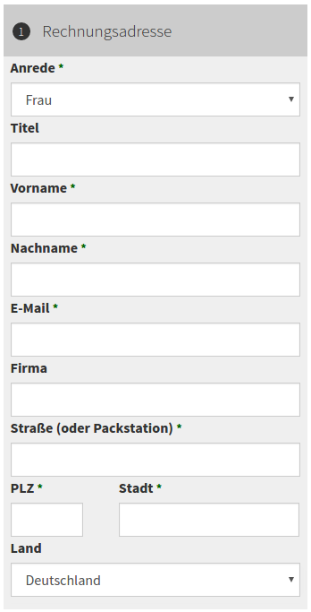

.. include:: ../../../Includes.txt

Auswahlliste für Formularfelder
===============================

Die Eingabefelder für die Rechnungs- und Lieferadresse sind alles normale einzeilige Eingabefelder. Manchmal möchte man aber eine Auswahlliste für die Anrede oder das Land umsetzen.
Das ist recht einfach möglich. Das Beispiel zeigt die Lösung mit einer neuen Konfiguration über TypoScript. Es könnte aber auch einfach über ein Array im Fluid-Template umgesetzt werden.

Als erstes legt man eine neue Konfiguration an:

::

   plugin.tx_cart {
       settings {
           salutations {
               Frau = Frau
               Herr = Herr
           }
           countries {
               DE = Deutschland
               AT = Österreich
               CH = Schweiz
           }
       }
   }

In den Adressdateien Partials/Cart/OrderForm/Address/Billing.html und Partials/Cart/OrderForm/Address/Shipping.html können dann die Textfelder durch den jeweilige Select-Element

::

   <f:form.select id="billingAddress:salutation" class="form-control" name="billingAddress[salutation]" options="{settings.salutations}" />

oder

::

   <f:form.select id="billingAddress:country" class="form-control" name="billingAddress[country]" options="{settings.countries}" />

ausgetauscht werden.