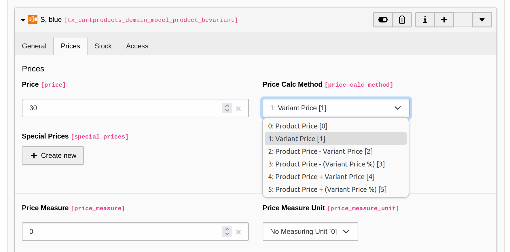
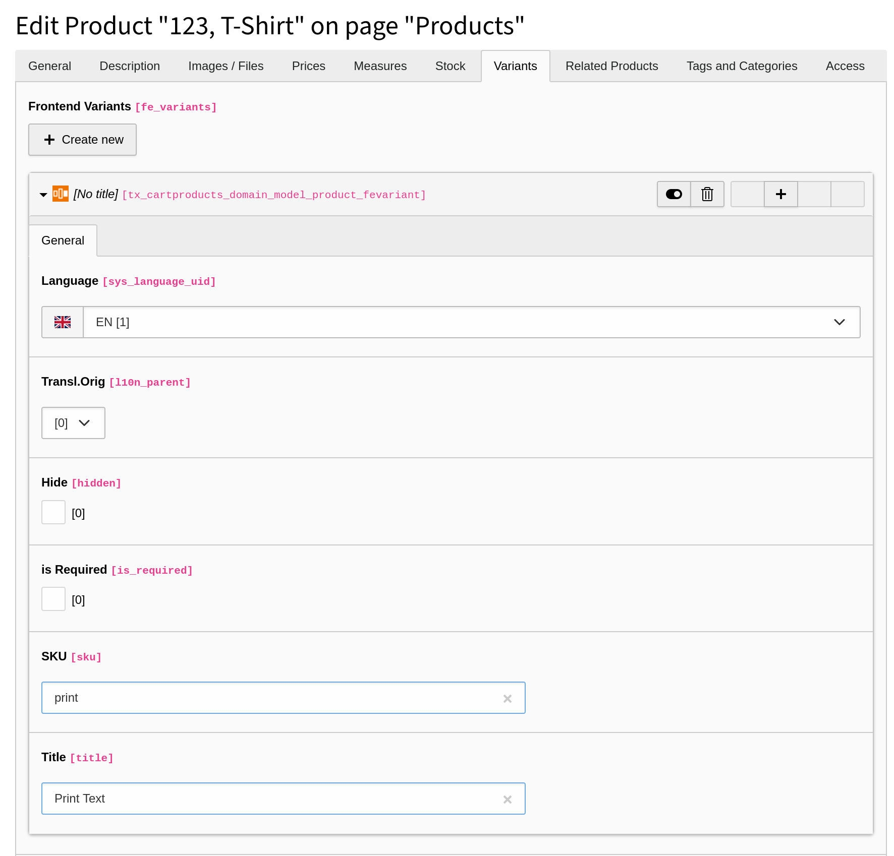

.. include:: ../../Includes.txt

========
Variants
========

Cart comes with two types of variants for products: Frontend Variants and
Backend Variants.

Difference between Frontend Variants and Backend Variants
=========================================================

Backend Variants can influence the price of a product while
Frontend Variants foremost are used to get additional data from the customer.

The following example uses a T-shirt asBE variant product to illustrates the
difference of both variants.

* **Frontend Variant**

  * The customer is able to enter a text which will be printed on the T-shirt.
    Therefore the product has an input field.
  * This does not influence the price of the product but just enables the
    customer to add additional information.

* **Backend Variant**

  * The shop owner sells the T-Shirt in different sizes *S*, *M*, *L*.
  * The available options are stored as BE variants in the product with
    different prices.
  * The customer can choose one of the options from a select list.
  * The choice of the customer changes the price of the T-Shirt.

Create Backend Variants
=======================

.. NOTE::

   Not all fields that can be filled in the backend during the following steps
   are shown in the frontend with the default templates. To show them you need
   to add custom templates.

It requires multiple steps to create Backend Variants. Which can be quite
overwhelming at the beginning offers maximum flexibility and is logical once
you get used to it.

..  rst-class:: bignums

1. Create a *Backend Variant Attribute*

   A *Backend Variant Attribute* determines the type of variant.

   An example is *Size* for a T-shirt.

   The record for a *Backend Variant Attribute* is created directly within a
   TYPO3 page.

   .. figure:: ../../Images/Editor/Records/Variants/Product-BackendVariantAttribute.png
      :width: 820
      :alt: Backend Variant Attributes
      :class: with-shadow

   .. NOTE::
      *Backend Variants* need to be placed on the same page as the product itself.

2. Create *Backend Variant Attribute Options*

   A *Backend Variant Attribute Options* is one certain instance of a
   *Backend Variant Attribute* which will be an option for the customer.

   An example is *XXL* as *Size* of a T-shirt.

   Such an attribute is created within a *Backend Variant Attribute*.

   .. figure:: ../../Images/Editor/Records/Variants/Product-BackendVariantAttributeOptions.png
      :width: 820
      :alt: Backend Variant Attributes Options
      :class: with-shadow

3. Set *Backend Variant Attributes* within Product

   The above defined *Backend Variants Attribute* is chosen within the product
   in the Tab "Variants".

   It is possible to define up to 3 different *Backend Variants Attributes*
   within a product, e.g. *size*, *color* and *cut*. The available combinations
   are defined in the next step.

   .. figure:: ../../Images/Editor/Records/Variants/Product-BackendVariantAttributes-in-Product.png
      :width: 820
      :alt: Backend Variant Attributes
      :class: with-shadow

4. Create final *Backend Variants* within Product

   Create a new *Backend Variant*.

   A single *Backend Variant* select for every above defined a
   *Backend Variant Attribute* an *Backend Variant Attribute Option*
   (as defined in step 2).

   .. figure:: ../../Images/Editor/Records/Variants/Product-BackendVariant.png
      :width: 820
      :alt: Backend Variant Attributes
      :class: with-shadow

5. Set further values for the variant

   Set which price this variant shall have (as described below), additionally it
   is possible to set stock and price measures.

Price calculation for Backend Variants
--------------------------------------

The price calculation for a Backend Variant can be set with multiple options:

==================================== =======================================================
Selection                            Description
==================================== =======================================================
1: Product Price                     Use price of product itself.
2: Variant Price                     Use price of variant itself.
3: Product Price - Variant Price     Subtract variant price from product price.
4: Product Price - (Variant Price %) Subtract variant as percentual amount of product price.
5: Product Price + Variant Price     Add variant price from product price.
6: Product Price + (Variant Price %) Add variant as percentual amount of product price.
==================================== =======================================================

Create Frontend Variants
========================

A *Frontend Variant* is created directly within the product in the tab Variants.

