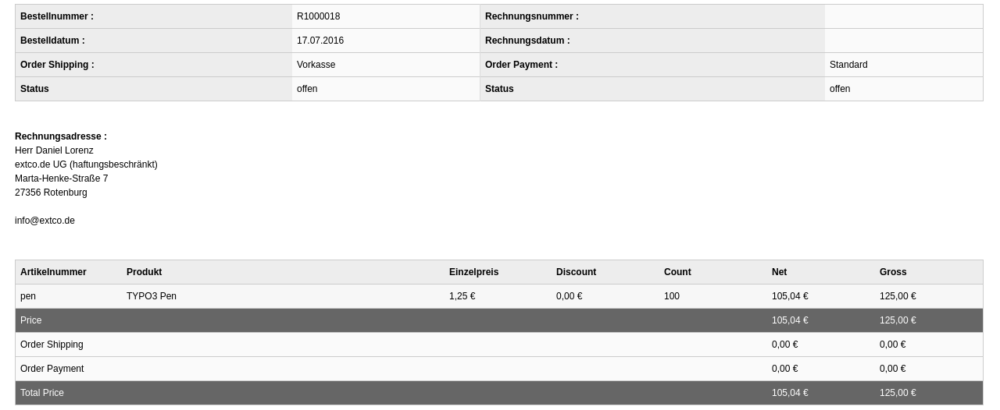

.. include:: ../../Includes.txt

.. _en_en_modules-orders:

=========================
Backend Module for Orders
=========================

The backend module "Orders" lists all orders which exists within a certain page
(folder). In contrast to the default view offers this module an optimized
view on the orders and better filter options.

.. figure:: ../../Images/Modules/Orders/List.png
   :width: 640
   :alt: List of all orders in a folder
   :class: with-shadow

   List of all orders in a folder

   Detail view of an order
