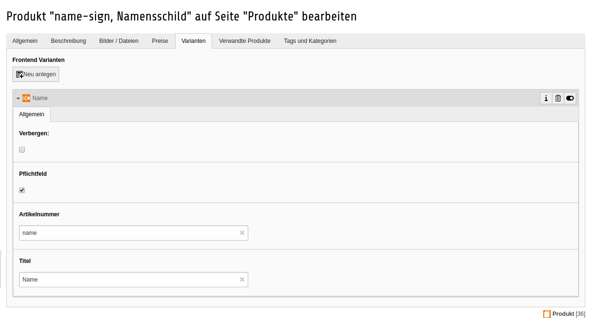

.. ==================================================
.. FOR YOUR INFORMATION
.. --------------------------------------------------
.. -*- coding: utf-8 -*- with BOM.

Frontend Varianten
==================

Frontend Varianten dienen dazu, dass der Nutzer sein Produkt über das Frontend individualisieren kann.
Dies kann zum Beispiel der Name für eine Namensschild sein, oder für die Bestellung personengebundener Tickets genutzt werden.

*Die Frontend Varianten sind derzeit noch nicht komplett umgesetzt. Es gibt derzeit lediglich die Möglichkeit normale einzeilige Eingabefelder zu erzeugen. Die Checkbox für das Pflichtfeld wird lediglich in das Template weitergereicht und kann dort für die Validierung per JavaScript genutzt werden. Eine serverseitige Validierung gibt es für Frontend Varianten noch nicht.*
