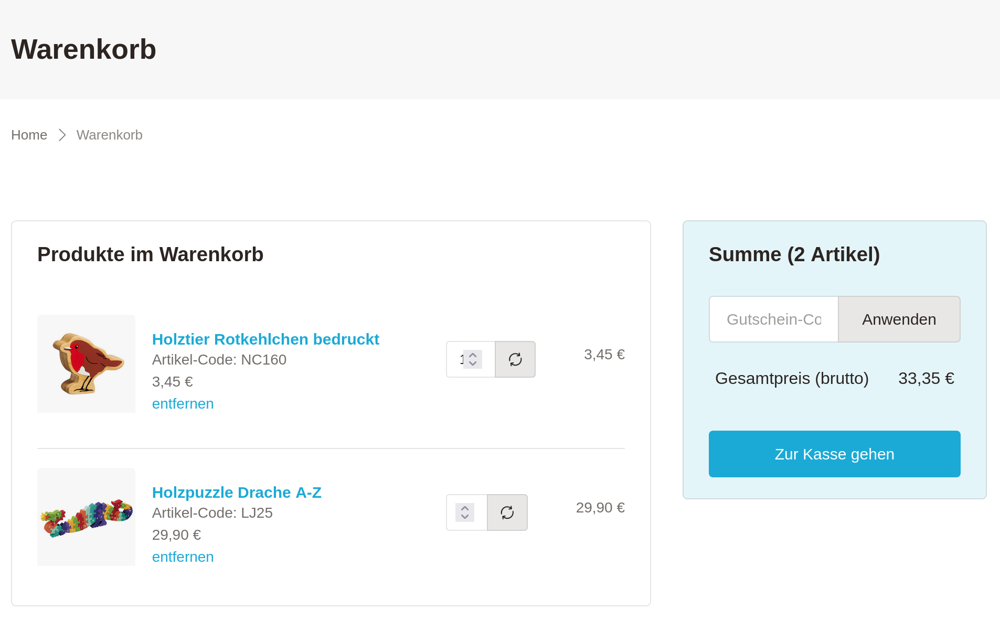

.. include:: ../Includes.rst.txt
  
.. _introduction:

============
Introduction
============

Cart is an extension providing a shopping solution for TYPO3.

Description
===========

The extension is a small but powerful extension which "solely" adds a shopping
cart to your TYPO3 installation and is well suited for content commerce.

The extension allows you to add products to a cart and handles the order
process completely.

There are other awesome extensions to handle various types of products.
Furthermore, you will find some payment provider extensions to add
payment methods to the checkout process.
Have a look at :ref:`other_cart_extensions`.

Features
========

* Makes intensive use of the TYPO3 Core API functionality (is "TYPO3-native").
* Easily expandable:

  * Multiple PSR-14 events and interfaces
  * API (finisher pipeline) to process the order with possibility to register
    own tasks
  * API to add payment providers
  * API to connect your own product extensions

* Highly configurable through TypoScript
* Proved Bootstrap templates
* Backend module to show and utilize orders

Aspects to decide whether to choose EXT:cart or another shop solution
=====================================================================

Arguments when to use EXT:cart
------------------------------

* **TYPO3-native shop:**  The shop is fully integrated in TYPO3. Your customer
  do not have to learn another system. And you (or your developer) does not have
  to learn another system as well.
* **TYPO3 know how:** You know how to work with TYPO3 (or have access to a
  TYPO3 integrator and/or TYPO3 developer).
* **Small project:** It's Suitable for smaller projects (see arguments against
  using EXT:cart).
* **Free open-source:** It's free and open source :)

Arguments when NOT to use EXT:cart
----------------------------------

* **Codeless configuration:** Other shop solutions may not demands any coding
  skills but for EXT:cart you need at least to know how to integrate an
  extension and how to set TypoScript configuration.
* **Simultaneous orders:** Products in the cart are not reserved for the
  customer. That means if another customer buys the last article in between the
  customer who added the product first to the cart will get an error during the
  checkout that the product is not available any longer.
* **Complex products:** With the extension EXT:cart_products you can define FE
  variants and BE variants which allows to make products customizable. But the
  amount of customization is limited. The amount of BE variant combinations is
  for example limited to three. Due to this it would for example not be possible
  to make a shop for bicycles where the customer can configure all aspects of a
  bicycle.
* **Upselling:** There are no advanced functionalities like upselling.
* **Customer support:** As it is open source it is not possible to get paid
  support. It's of course possible to get support from the community but it's
  not guaranteed to get the needed help.

Showcases
=========

Examples of websites which use this extension as e-commerce solution.

   `www.liebman-design-import.com <https://www.liebman-design-import.com/warenkorb/>`__

.. figure:: ../Images/Examples/weingut-isele.de.png
   :width: 640
   :alt: Cart of Weingut Isele
   :class: with-shadow

   `www.weingut-isele.de <https://www.weingut-isele.de>`__

**Table of contents**

.. toctree::
   :maxdepth: 5
   :titlesonly:

   Support/Index
   Sponsoring/Index
   NoteOfThanks/Index
