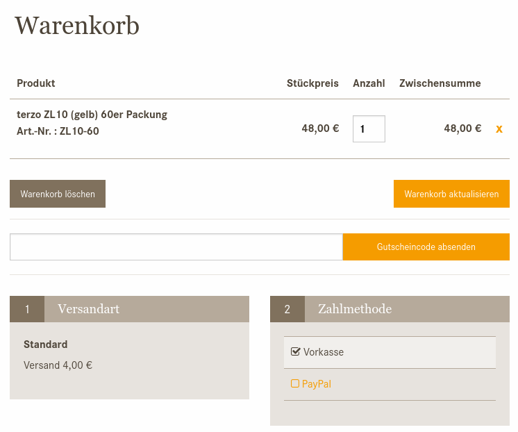
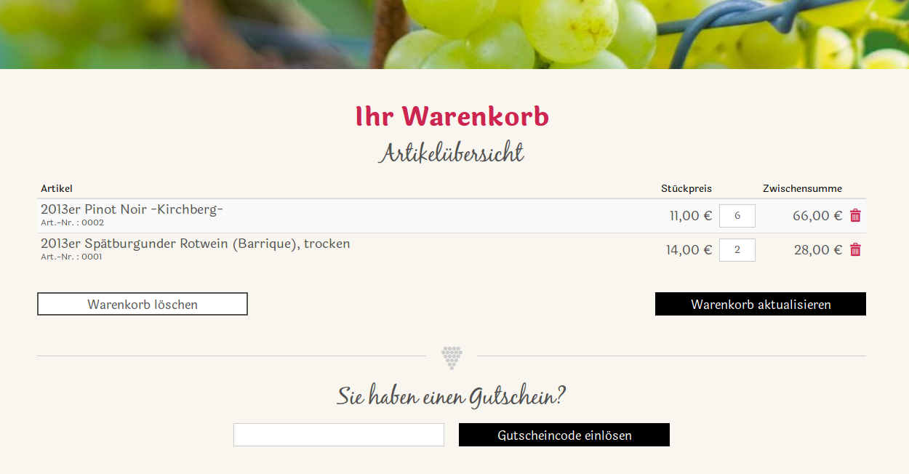

.. ==================================================
.. FOR YOUR INFORMATION
.. --------------------------------------------------
.. -*- coding: utf-8 -*- with BOM.

Introduction
------------

Cart is an extension providing a shopping solution for TYPO3.

Focus
=====

The focus of Cart are TYPO3 webpages with the need for a shopping solution.
Cart has no restriction on the maximum number of products. The restriction is more likely the number of orders to be
managed. Providing APIs to good economy systems are not planned.
The number of modules to add more functionality to Cart is still limited. There are some payment provider extensions
available. An other extension generates PDF documents for order confirmation,
invoices or delivery notes.
The focus in the development of Cart is that despite all the possibilities (variants, front-end variants, coupons, ...) in the first installation remains very simple.
In addition, finishers, signal slots and hooks should offer the opportunity to expand the shopping cart by own functions
or to control the order processing.

Examples
========

Hörgeräte ISMA (hearing aid)
^^^^^^^^^^^^^^^^^^^^^^^^^^^^

`www.hoergeraete-isma.de <https://www.hoergeraete-isma.de/shop>`__

Weingut Isele (winery)
^^^^^^^^^^^^^^^^^^^^^^

`www.weingut-isele.de <http://www.weingut-isele.de>`__

.. toctree::
   :maxdepth: 5
   :titlesonly:

   Support/Index
   Sponsoring/Index
   NoteOfThanks/Index
