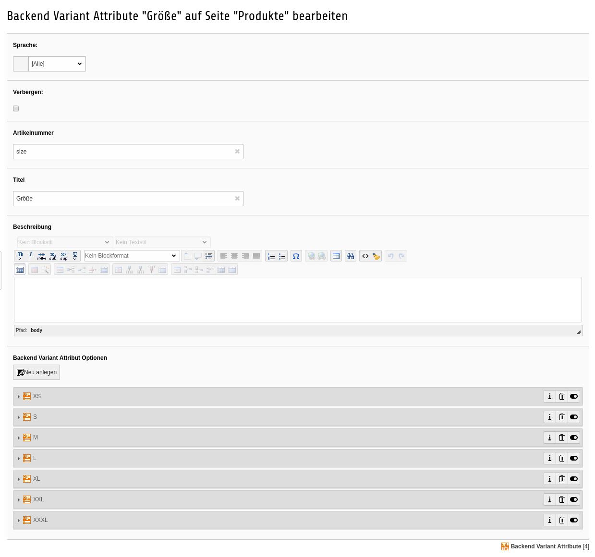
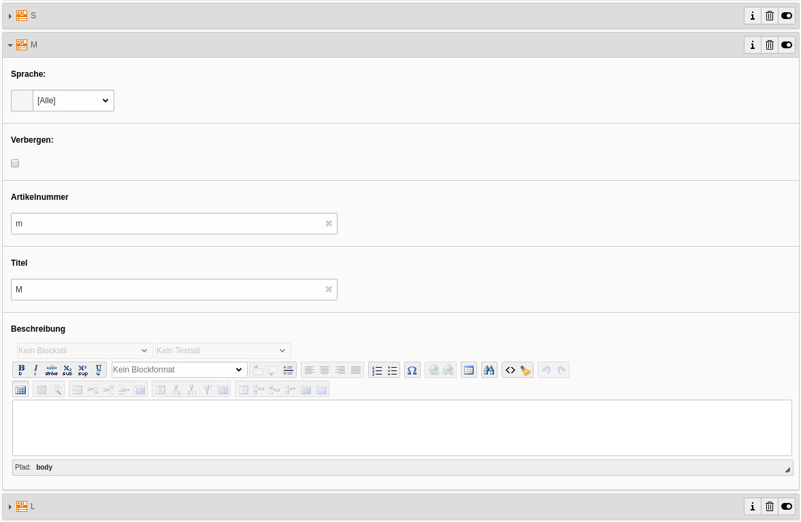
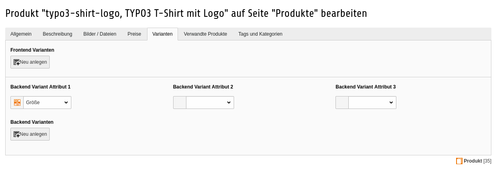
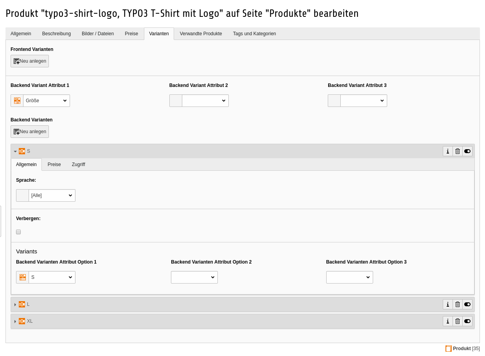

.. ==================================================
.. FOR YOUR INFORMATION
.. --------------------------------------------------
.. -*- coding: utf-8 -*- with BOM.

Backend Varianten
=================

Backend Varianten anlegen
-------------------------

Die Backend Varianten bestehen zum einen aus Backend Variant Attributen und ihren Backend Variant Attribut Optionen. Diese sind Voraussetzung um in konfigurierbaren Produkten Varianten anlegen zu können.
Die Backend Variant Attribute können dabei alle möglichen Optionen abdecken, angefangen bei A wie Arbeitsspeicher über die Farbe, die Größe, das Gewicht oder das Volumen bis hin zu Z wie Zubehör. Die Backend Variant Attribut Optionen sind dann die verschiedenen Ausprägung die diese im Shop theoretisch haben kann.

Ein Beispiel:

Im Shop sollen T-Shirts unterschiedlicher Größe verkauft werden, dann wird dafür ein Backend Variant Attribut angelegt, sofern es nicht schon eine solche für andere
Artikel gibt (z.B. Pullover oder Hosen).

Für dieses Backend Variant Attribut wurden nun verschiedene Optionen definiert. Später müssen nicht alle Optionen in einem Produkt zur Anwendung kommen. Gibt es das T-Shirt nur in den Größen S, L und XL sollte man sich trotzdem schon überlegen auch die anderen Optionen anzulegen, denn die Backend Variant Attribute können produktübergreifend angelegt und genutzt werden. Interessant ist die vor allem um später Relationen zu ähnlichen Produkte aufbauen zu können.

Im Shop sollen verschiedene T-Shirts angeboten werden. Für die Kindergrößen gibt es vielleicht ein eigenes Backend Variant Attribut, so dass diese hier nur die Backend Variant Attribut Optionen XS - XXXL geben soll.

Backend Varianten verwenden
---------------------------

In konfigurierbaren Produkten können die Backend Varianten dann verwendet werden. Dazu kann man einem Produkt (aktuell) drei verschiedene Backend Variant Attribute zuweisen.
Bei einem T-Shirt wäre neben der Größe auch die Farbe interessant.

Nach der Auswahl einer Backend Variant Option muss auf jeden Fall das Produkt gespeichert werden, damit für die darunter anzulegenden Backend Varianten bekannt ist, welches der Backend Variant Attribute genutzt werden soll. So werden dann beim Anlegen einer Backend Variante nur die möglichen Optionen angezeigt.
Für jede verfügbare Option wird nun eine eigene Backend Variante angelegt.

Backend Varianten anpassen
--------------------------

Für die verschiedenen Backend Varianten im Produkt lassen sich nun individuelle Werte für den Preis (inkl. Spezialpreise), die Maßangaben und den Lagerbestand pflegen.
Die Preise für die Varianten lassen sich mit verschiedenen Methoden berechnen.

- **0: Produktpreis**: Diese ist die einfachste aller Preisregeln für ein Produkt. Es gibt kein vom Produkt abweichenden
  Preis. Spezialpreise das Produkts gelten auch für die Variante.
- **1: Variantenpreis**: Ist neben der Produktpreisregel ebenfalls einfach. Es wird der Preis wie er in der Variante
  gepflegt wird genutzt. Der Preis des Produkts, auch die Spezielpreise des Produkts finden hier keine Anwendung.
- **2: Produktpreis - Variantenpreis**: Bei dieser Preisberechnungsmethode wird vom Produktpreis der Variantenpreis (absolut)
  abgezogen. Ist am Produkt ein Spezialpreis gepflegt dient dieser als Grundlage für die Berechnung. Ist an der Variante
  ein Spezialpreis gepfegt wird auch dieser genutzt.
- **3: Produktpreis - (Variantenpreis %)**: Bei dieser Preisberechnungsmethode wird vom Produktpreis der Variantenpreis
  in Prozent abgezogen. Ist am Produkt ein Spezialpreis gepflegt dient dieser als Grundlage für die Berechnung. Ist an der Variante
  ein Spezialpreis gepfegt wird auch dieser genutzt.
- **4: Produktpreis + Variantenpreis**: Bei dieser Preisberechnungsmethode wird zum Produktpreis der Variantenpreis (absolut)
  addiert. Ist am Produkt ein Spezialpreis gepflegt dient dieser als Grundlage für die Berechnung. Ist an der Variante
  ein Spezialpreis gepfegt wird auch dieser genutzt.
- **5: Produktpreis + (Variantenpreis %)**: Bei dieser Preisberechnungsmethode wird auf den Produktpreis der Variantenpreis
  in Prozent aufgeschlagen. Ist am Produkt ein Spezialpreis gepflegt dient dieser als Grundlage für die Berechnung. Ist an der Variante
  ein Spezialpreis gepfegt wird auch dieser genutzt.

**Für alle Preisberechnungsmethoden (2-5) gilt. Bei den Berechnungen kommt immer der für den Kunden günstigste Preis heraus.**
So wird ver Spezialpreis nur genutzt, wenn dieser den Kunden gegenüber dem Normalpreis einen Vorteil bringt, das Produkt also
günstiger macht. Insbesondere bei den Preisberechnungsmethoden 2 und 3 muss dann beim Sezialpreis ein höherer Wert stehen als
im Preisfeld, da sonst die Berechnung zu einem höhere Produktpreis führen würde.