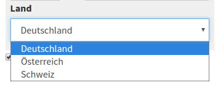
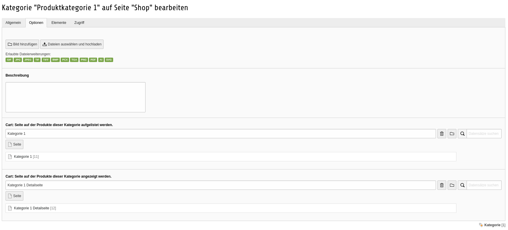

.. ==================================================
.. FOR YOUR INFORMATION
.. --------------------------------------------------
.. -*- coding: utf-8 -*- with BOM.

3.0.0 - 05.03.2017
------------------

Diese Version wird einige Änderungen mit sich bringen. Darunter befinden sich einige neue Funktionen, aber auch ein paar Änderungen, die Anpassungen an bestehenden Installationen erforderlich machen. Dieser ChangeLog-Eintrag sollte daher sorgfältig durchgearbeitet werden.

#63 Mengenrabatt / Staffelpreise
================================

Eine neue Funktion ist der Mengenrabatt, oder sogenannte Staffelpreise. Damit kann der Einzelpreis der Produkts abhängig von der Anzahl des Produkts im Warenkorb gemacht werden.
Wie auch bei den Spezialpreisen kann dieser auf Frontend Nutzergruppen eingeschränkt werden.
Sollten Staffelpreise und Mengenrabatte angegeben sein, wird der für den Käufer günstigste Preis für die weiteren Berechnungen genutzt.

.. IMPORTANT::
   Es ist eine Aktualisierung der Datenbank erforderlich. Da dieses Feld neu hinzu kommt, sollte das in der Regel unproblematisch sein.

#56 Bezahl- und Versandmethoden nach Rechnungs- oder Lieferland
===============================================================

Eine neue Funktion ist es, dass die zur Verfügung stehenden Bezahlmethoden und Versandmethoden je nach gewähltem Rechnungsland oder Bestimmungsland unterschiedlich definiert sein können.
Damit lassen sich verschiedene Versandkosten je nach Bestimmungsland abbilden, aber auch Bezahlmethoden auf einzelne Länder einschränken.
Als Nebeneffekt dieser Änderung, wird nun auch die Warenkorbseite bei Änderung der Zahlmethode nicht mehr komplett neu geladen. Dies brachte immer Problem mit schon eingegebenen Adressen mit sich.

.. IMPORTANT::
   Diese Änderung wirkt sich auf die TypoScript Konfiguration, aber auch auf die Darstellung im Front- und Backend aus. Soweit möglich kann mit der bisherigen TypoScript-Konfiguration weiter gearbeitet werden, wenn die neue Konfiguration im eigenen TypoScript nicht verwendet wird.
   Es ist aber unbedingt zu prüfen, ob die eigenen definierten Bezahl- und Versandmethoden wie gewohnt zur Verfügung stehen.
   Statt des Freitext-Feldes bringt das Template jetzt ein Auswahlfeld für das Land mit.

TypoScript
^^^^^^^^^^
Neu hinzugekommen ist die Konfiguration plugin.tx_cart.settings.allowedCountries, welche die Ausgabe des Auswahlfeldes für die Länder im Warenkorb definiert.
Durch einen eigenen SelectViewhelper können die Optionen auch übersetzt werden. Dazu im nächsten Absatz mehr.
Der Parameter plugin.tx_cart.settings.defaultCountry definiert welches Land vorausgewählt werden soll.

::

   plugin.tx_cart {
       settings {
           allowedCountries {
               de = Deutschland
               at = Österreich
               ch = Schweiz
           }
           defaultCountry = de
       }
   }

|

Weiterhin wurde die Konfiguration für die Konfiguration innerhalb von plugin.tx_cart.payments und plugin.tx_cart.shippings um eine Konfigurationsebene erweitert. Die die Konfiguration für das jeweilige Land wiederspiegeln.

::

   plugin.tx_cart {
       payments {
           de {
               preset = 1
               options {
                   1 {
                       title = Vorkasse
                       extra = 0.00
                       taxClassId = 1
                       status = open
                   }
               }
           }
           at < .de
           ch < .de
       }
       shippings {
           de {
               preset = 1
               options {
                   1 {
                       title = Standard
                       extra = 0.00
                       taxClassId = 1
                       status = open
                   }
               }
           }
           at < .de
           ch < .de
       }
   }

|

Soll die bisherige TypoScript Konfiguration genutzt werden und wird das Standard-TypoScript eingebunden, muss die neue Konfiguration entfernt werden:

::

   plugin.tx_cart {
       payments {
           de >
           at >
           ch >
       }
       shippings {
           de >
           at >
           ch >
       }
   }

|

Templates
^^^^^^^^^

Durch die neue Möglichkeit die Länder über plugin.tx_cart.settings.allowedCountries zu konfigurieren, konnte auch die Eingabe des Landes im Frontend über ein Auswahlfeld realisiert werden.
Da der SelectViewHelper aus Fluid keine Übersetzung für die Array-Konfiguration ermöglicht, bringt Cart einen eigenen SelectViewHelper mit, der den Fluid SelectViewHelper entsprechend erweitert.
Gibt man dem selectViewHelper noch das Argument translationKey mit, versucht der SelectViewHelper eine passende Übersetzung zu finden.

::

    <cart:form.select id="billingAddress:country"
                      class="form-control"
                      name="billingAddress[country]"
                      value="{cart.billingCountry}"
                      options="{settings.allowedCountries}"
                      translationKey="tx_cart.settings.allowed_countries"/>

|

Im Frontend könnte das dann wie folgt aussehen:

Eine entsprechende Erweiterung des JavaScripts sorgt dafür, dass die Auswahl an den Server übertragen und in der Session gespeichert wird.
Als Antwort werden die möglichen Zahlungsmethoden übertragen und ggf. die geänderte Zusammenfassung des Warenkorbs.
Die Warenkorbzusammenfassung wird ebenfalls aktuakisiert, denn die Auswahl des Landes kann Auswirkungen auf die Service- und Versandkosten und den Gesamtpreis haben.

Durch die Änderung wird nun aber nur noch der ISO-Code aus der TypoScript-Konfiguration in der Bestellung gespeichert. Entsprechend müssen auch die Templates für den E-Mail-Versand und die
Templates im Backend angepasst werden. Die Default-Templates der Cart-Erweiterung bringen eine entsprechende Änderung mit. Eigene Templates müssen entsprechend angepasst werden.

#58 Produkt-Hauptkategorie und Canonical Tags
=============================================

Eine weitere Änderung betrifft die Einführung der Hauptkategorien und löst das Duplicate Content Problem.
Wird ein Produkt mehreren Kategorien zugeordnet und wird nun auf verschiedenen Kategorieseiten in Detailansicht angezeigt, kommt es unweigerlich zu dazu, dass die gleiche Detailseite unter verschiedenen URLs erreichbar ist. Den Nutzer stört das weniger, aber Suchmaschinen strafen das ab.
Nutzt man die Möglichkeit Produkte verschiedenen Kategorien zuzuordnen, kann man nun eine Hauptkategorie bestimmen. Damit das Canonical Tag dann auch korrekt generiert werden kann, muss man jeder Kategorie, die für Produkte verwendet wird, eine Seite zuweisen, auf der die Detailseiten dieser Kategorie ausgegeben werden sollen.
Dazu besteht schon seit einiger Zeit die Möglichkeit in den Kategorieeigenschaften.

Die Ausgabe der Listenansicht beachtet beide Felder, so muss für die assoziierten Kategorien die Hauptkategorie nicht noch einmal ausgewählt werden.

.. NOTE::
   Wenn das Template der Produktdetailseite durch ein eigenes Template ersetzt wurde, sollte hier noch der CanonicalTag ViewHelper (<cart:canonicalTag product="{product}" />) eingebunden werden.

#73 Ausgabe der komplette Artikelnummer im Warenkorb bei Produkten mit Varianten
================================================================================

Im Warenkorb und den E-Mails wurde für Produkte mit Varianten nur die Artiḱelnummer (der Variante) ausgegeben. Die Funktion die Artikelnummer der Variante mit vorangestellter Artikelnummer des Produkts gab es bereits, wurde aber in den Templates bisher nicht verwendet.
Die Änderungen zeigen jetzt die komplette Artikelnummer.

Wenn die Templates:

* cart/Resources/Private/Partials/Cart/ProductForm/ProductList.html
* cart/Resources/Private/Partials/Mail/ProductList.html

durch eigene Dateien ersetzt wurden, kann in diesen Dateien *{variant.sku}* durch *{variant.completeSku}* ersetzt werden.

#68 Signal Slot 'checkProductsBeforeAddToCart'
==============================================

Ein neuer Signal Slot, der es erlaubt vor dem Hinzufügen von Produkten eigene Tests durchzuführen.
Mit diesem Signal Slot ist es möglich Produkte, die hinzugefügt werden sollen zu verändern oder zu entfernen. Eigene Warn- oder Fehlermeldungen werden zu den FlashMessages hinzugefügt.

#76 Verbesserungen für lesbare URLs (realurl)
=============================================

Um noch "saubere" lesbare URLs mit realurl erzeugen zu können wurde die Standard-Action für das Plugin "Cart: Produkt" geändert.
Die Switchable-Controller-Action "Produkt - Listen- und Detailansicht" hat nun als Standard-Action die Detailansicht, leitet aber auf Listenansich weiter, wenn kein Produkt übergeben wird. Damit ist es möglich, die Angabe der Action für die Detailansicht weg zu lassen.

.. IMPORTANT::
   Durch diese Änderungen sind alle Stellen, an denen das Plugin mit der Switchable-Controller-Action "Produkt - Listen- und Detailansicht" eingebunden ist, neu zu speichern.

Eine Beispielkonfiguration (Auszug) für realurl könnte wie folgt aussehen:

::

    'fixedPostVars' => [
        'cartShowCart' => [
            [
                'GETvar' => 'tx_cart_cart[action]',
                'valueMap' => array(
                    '' => 'showCart',
                )
            ],
            [
                'GETvar' => 'tx_cart_cart[controller]',
                'noMatch' => 'bypass'
            ]
        ],
        'cartDetailConfiguration' => [
            [
                'GETvar' => 'tx_cart_product[product]',
                'lookUpTable' => [
                    'table' => 'tx_cart_domain_model_product_product',
                    'id_field' => 'uid',
                    'alias_field' => 'title',
                    'addWhereClause' => ' AND NOT deleted',
                    'useUniqueCache' => 1,
                    'useUniqueCache_conf' => [
                        'strtolower' => 1,
                        'spaceCharacter' => '-'
                    ],
                    'languageGetVar' => 'L',
                    'languageExceptionUids' => '',
                    'languageField' => 'sys_language_uid',
                    'transOrigPointerField' => 'l10n_parent',
                    'autoUpdate' => 1,
                    'expireDays' => 180,
                ]
            ],
            [
                'GETvar' => 'tx_cart_product[controller]',
                'noMatch' => 'bypass'
            ]
        ],
    ],

|

Diese erzeugt unter anderem Links aus dem Produkttitel.

*Eine ausführlichere Dokumentation mit weiteren Beispielen folgt.*

#74 Ausgabe der Umsatzsteuer im Warenkorb und E-Mails
=====================================================

Im Warenkorb und den E-Mails der Standard-Templates wurden bisher die Steuklassen (normal, reduziert, frei) ausgegeben. Nun wird an diesen Stellen die Umsatzsteuer mit der entsprechenden Prozentangabe aus der Konfiguration angezeigt.
Bisher war dies nur unter Verwendung des f:for-ViewHelpers und f:if-ViewHelpers oder die Anpassung über die Übersetzungsdateien möglich. Eine Konfiguration mit weiteren Steuerklassen war hier schwierig.
Der neue ViewHelper liefert die richtige Steuerklasse aus der Konfiguration zurück.

.. NOTE::
   Diese Änderung kann in eigene Templates übernommen werden. Eine Anpassung ist nicht zwingend erforderlich.

#77 Signal Slot 'changeOrderItemBeforeSaving'
=============================================

Ein neuer Signal Slot, der es erlaubt vor dem Speichern einer Bestellung diese noch einmal zu bearbeiten.

.. IMPORTANT::
   Dieser Signal Slot ist dafür gedacht, um zum Beisiel die (neuen) Adressen eines Käufers zu den Kontaktdaten hinzuzufügen. Er sollte nicht genutzt werden, um Änderungen an den Preisen oder Produkten vorzunehmen.

#78 Testing Framework für UnitTests
===================================

Dies hat keine Auswirkung auf die Verwendung von Cart und dient nur zum Testen.

#78 Signal Slot 'beforeHandlePayment', 'handlePayment' und 'afterHandlePayment'
===============================================================================

Die neuen Signal Slots, erlauben es vor oder nach dem eigentlichen 'handlePayment' eigene Aktionen durchzuführen.

.. IMPORTANT::
   Der Signal Slot 'handlePaymentAfterOrder' wurde in 'handlePayment' umbenannt. Wer diesen Signal Slot bereits verwendet muss unbedingt den Aufruf anpassen.
   Bisher wurden dieser für die Erweiterungen CartPaypal, CartGirosolution, CartPayone und CartSaferpay verwendet. Ein entsprechendes Update dieser Erweiterungen wird ebenfalls bereitgestellt.

#80 Signal Slot 'loadCartProductFromForeignDataStorage' zum Laden von Produkten aus externen Quellen
====================================================================================================

Um das Laden von Produkten aus fremden Quellen (Tabellen, Repositories) und eigenen Logiken zu vereinfachen wird nun ein Signal Slot angeboten.
Die ausgelagerte ProductUtility Klasse beinhaltent nur noch die Logik um die Produkte aus den Cart Tabellen zu laden und für den Warenkorb aufzubereiten. Die Konfiguration über TypoScript entfällt.

.. IMPORTANT::
   Wer schon jetzt Produkte aus anderen Datenbanktabellen benötig, muss den Signal Slot 'loadCartProductFromForeignDataStorage' verwenden, um die Produkte aus der jeweiligen Quelle zu laden.

Eine Beispielimplementierung und die Einbindung in Cart ist in der Erweiterung `CartSimpleProduct <https://github.com/extcode/cart_simple_product>`__  gezeigt.

Da sich die Implementierung nur noch auf die mitgebrachten Produkttabellen beschränkt können die TypoScript-Konfigurationen aufgeräumt werden.
Eine Konfiguration der Getter und Setter ist über TypoScript nicht mehr nötig und möglich.

Das mitgelieferte TypoScript sieht in etwa so aus:

::

   plugin.tx_cart {
       db >
       repository >

       productStorages {
           1 {
               class = Extcode\Cart\Domain\Repository\Product\ProductRepository
           }
       }
   }

|

Für die eigene Produkttabelle oder das eigene Produktrepository kann dann entsprechend eine eigene Konfiguration 2 hinterlegt werden.

.. IMPORTANT::
   Das Formular zum Hinzufügen von Produkten zum Warenkorb kann das optionale Feld 'productStorageId' enthalten. Dieses bestimmt, welche Konfiguration genutzt wird.
   Ist die konfigurierte Klasse eine andere als Extcode\Cart\Domain\Repository\Product\ProductRepository, werden alle registrierten Slots ausgeführt. In der eigenen Klasse muss dann entschieden werden, ob diese für die übergebene productStorageId verantwortlich ist.
   Dann kann mit den aus dem Storage geladenen Daten ein Cart\Product erzeugt und zurückgegeben werden.

#10 und #48 Erweiterung des VariantSelectViewHelpers um die Argumente "class", "blank" und "required"
=====================================================================================================

Der SelectViewHelper hat ein paar neue Argumente bekommen.

* class: fügt die angegebenen CSS-Klassen dem <select> Tag hinzu (optional, Standardwert: '')
* required: fügt dem <select> Tag das required Attribut hinzu (optional, Standardwert: true)
* blank: fügt eine Option mit dem angegebenen Argument als Label und leerem Value hinzu (optional. Standardwert: '')

Wenn das Templates:

* cart/Resources/Private/Partials/Product/CartForm.html

durch eine eigene Datei ersetzt wurde oder das blank-Argument nicht verwendet werden soll, dann ist ggf. das entsprechende Template anzupassen.

#66 Aktualisierung des Zahlungs- und Versandstatus im Backendmodul
==================================================================

Es ist nun möglich auch den Zahlungs- und Versandstatus über das Backendmodul zu pflegen und so der Bestellung den entsprechenden Status zu geben.
Ein Möglichkeit weitere E-Mails an den Käufer zu senden, der über die Statusänderung informiert, ist mit einer der nächsten Versionen geplant.
